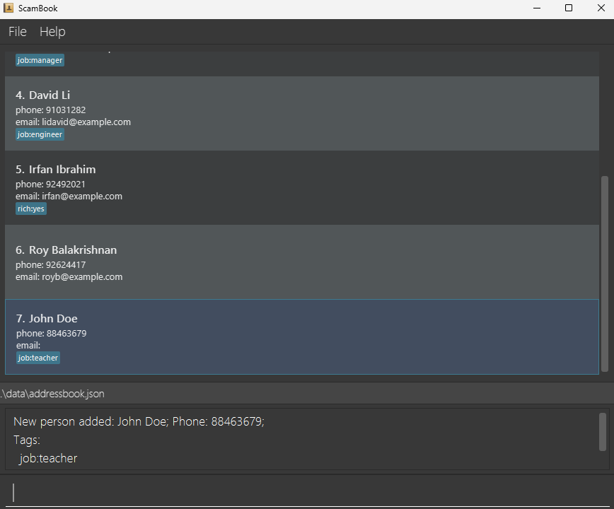

ScamBook User Guide
---

<!-- * Table of Contents -->
<page-nav-print />

## Introduction

### What is ScamBook?

ScamBook is a **desktop contact management app** optimised for use via a Command Line Interface (CLI) while still having the benefits of a Graphical User Interface (GUI).

### Who is ScamBook for?

ScamBook is designed for **Singapore-based investment and financial scam callers** managing a high volume of victim contacts daily. If you are a scammer who:
* is **tech-savvy** and prefer typing to clicking, and comfortable with
a command line interfaces (CLI);
* operates as a **solo caller** and need a private, single-user system to
manage your contacts;
* handles **hundreds to thousands of contacts** and need a system that can
scale to your needs;
* needs to manage and update contacts **on-the-go during live calls**;

ScamBook is the app for you!

<!-- TODO: Potentially include a table of problems solved, value
proposition, etc. -->

--------------------------------------------------------------------------------------------------------------------

<!-- Quickstart appropriate for target users and fit-for-purpose -->
## Quick start

<!-- Quickstart: Installation instructions -->
### Installation
1. Ensure you have Java `17` or above installed in your Computer. 
   **Mac users:** Ensure you have the precise JDK version found
   [here](https://se-education.org/guides/tutorials/javaInstallationMac.html).
   <!-- TODO: Add detailed checking/installation instructions for JDK -->

1. Download the latest `.jar` file from
   [here](https://github.com/AY2526S2-CS2103T-T16-1/tp/releases).

1. Copy the file to the folder you want to use as the _home folder_ for
   your ScamBook.

1. Double-click on the .jar file to run the application. If the application does not launch,
refer to [FAQ](#Troubleshooting) for alternate ways to launch the application

<!-- Quickstart: Overview of UI -->
### Overview
A GUI similar to the below should appear in a few seconds. The app contains some sample data for you to use. 

 <!-- TODO: annotated screenshot of the UI -->

The top part of the application is the contact list - you can view contacts there.

The box at the bottom that reads "Enter command here..." is where you enter commands. This is where you get to interact with ScamBook!

### Entering a Command

Our sample data contains six people. This example will show how to add a 7th contact. 

We can use the `add` command to create a new contact. In the box at the bottom, type `add`.

Upon typing `add`, the format for the rest of the command will appear.
The command's format is `add NAME [--phone PHONE] [--email EMAIL] [--tag NAME:VALUE]...`.

Each command's format is given as a sequence of compulsory parameters, and optional parameters denoted in square brackets `[]`.
In this command, `NAME` is a compulsory parameter, while phone, email and tags are optional parameters.

Suppose we want to add a contact with the following information:
- Name: John Doe
- Phone: 88463679
- Extra information:
  - Job: teacher

We can enter the command `add John Doe --phone 88463679 --tag job : teacher` and press enter.

We can see that we have created a new contact John Doe.

To understand more about how to interpret the command formats, refer to [Command Format Information](#command-format-information)

Refer to the [Command List](#commands) below for details of each command, or the [Commands Summary](#commands-summary) section for a quick summary of all commands and their formats.

--------------------------------------------------------------------------------------------------------------------

<!-- Disclaimer for command format, applicable to all commands -->
<box type="info" seamless>

## Command Format Information

* Words in `UPPER_CASE` are the parameters to be supplied by the user. They can contain spaces and special characters (except `index`, which expects a single positive integer).  
  e.g. in `add NAME`, `NAME` is a parameter which can be used as `add John Doe`.

* Parameters in `[square brackets]` are optional. 
  e.g `NAME [--phone PHONE]` can be used as `John Doe --phone 88463679` or as `John Doe`.

* The Parameter `INDEX` refers to the number on the left side of the address book.
  * For example, the delete command has the format `delete INDEX`. If we type `delete 4`, ScamBook will delete David Li's entry in the below example:
    

* Parameters with `…`​ after them can be used multiple times (including zero times). 
  e.g. `[--tag NAME:VALUE]…​` can be used as ` ` (i.e. 0 times), `--tag school:NUS`, `--tag school:NUS --tag salary:10000` etc.
  * For each parameter that can be used multiple times, each command should contain up to 100 of such parameters.
  * In the above command of `[--tag NAME:VALUE]…​`, the command should have up to 100 occurrences of `--tag`. Above this, the behaviour is undefined.

* Mandatory parameters must come before optional parameters. 
  e.g. if the command specifies `NAME [--phone PHONE]`, `--phone 88091246 John` is not acceptable.

* Optional parameters can be in any order. 
  e.g. if the command specifies `[--phone PHONE] [--email EMAIL]`, `--email john@example.com --phone 91842739` is also acceptable.

* Extraneous parameters for commands that do not take in parameters (such as `help`, `list`, `exit` and `clear`) will be ignored.  e.g. if the command input is `help 123`, it will be interpreted as `help`.

* If you are using a PDF version of this document, be careful when copying and pasting commands that span multiple lines as space characters surrounding line-breaks may be omitted when copied over to the application.
</box>

<!--
Command User guide format:

### Command description (within 5 words) : `command`
Short description of the command.

Format: `command [parameters]`

[Following sections are optional, include only if applicable (try to be minimal)]

<box type="warning" seamless>
Warning about the command, e.g. common mistakes, important notes, etc.
</box>

Expected output or behaviour if the command is executed successfully. Use
screenshots (properly cropped) only if necessary, e.g. if the output is too
long or contains formatting that is hard to represent in text.

Examples: [DO NOT include unrealistic examples (use realistic params.) and DO
NOT include unlikely user input (e.g., names with backslaches) if already
handled by the app.]
* `Expected input`
  Explanation of output or behaviour if needed

<box type="tip" seamless>
Tips about the command, e.g. how to use it more effectively, etc.
</box>

-->

## Commands

### Adding a person: `add`

Adds a person to the ScamBook.

Format: `add NAME [--phone PHONE] [--email EMAIL] [--tag TAGNAME:TAGVALUE]...`

* Duplicate names are allowed, since it is likely one might encounter multiple people with the same (first) names. Hence, ScamBook supports having multiple people with the same name.
* If multiple tag name-value pairs have the same tag name (see section on [Tag](#tagging-a-person--tag) below regarding tag name equality), the last value will be used.

<box type="tip" seamless>
<b>Tip:</b> A person can have any number of tags (including 0)
</box>

Examples:
* `add John Doe --phone 98765432 --email johnd@example.com --tag address:John street, block 123, #01-01`
* `add Besty Croew --tag income:$100000 --tag bank:OCBC`

### Editing a person : `edit`

Edits an existing person's name, phone number or email. For editing tags, see the [Tag Command](#tagging-a-person--tag).

Format: `edit INDEX [--name NAME] [--phone PHONE] [--email EMAIL]`

* Edits the person at the specified `INDEX`. The index refers to the index number shown in the displayed person list. The index **must be a positive integer** 1, 2, 3, …​
* At least one of the optional fields must be provided.
* Existing values will be overwritten by the input values.

Examples:
* `edit 1 --phone 91234567 --email johndoe@example.com` Edits the phone number and email address of the 1st person to be `91234567` and `johndoe@example.com` respectively.
* `edit 2 --name Betsy Crower` Edits the name of the 2nd person to be `Betsy Crower`.

### Deleting a person : `delete`

Deletes the specified person from the ScamBook.

Format: `delete INDEX`

* Deletes the person at the specified `INDEX`.

Examples:
* `list` followed by `delete 2` deletes the 2nd person in the ScamBook.
* `find Betsy` followed by `delete 1` deletes the 1st person in the results of the `find` command.

### Tagging a person : `tag`

<!-- TODO: add visuals -->

Modifies (add, edit or delete) the tags of an existing person in the ScamBook.

Format: `tag INDEX [--add NAME:VALUE]... [--edit NAME:VALUE]... [--delete TAGNAME]...​`

<box type="warning" seamless>
<b>Caution:</b> <code>NAME</code>, <code>VALUE</code>, <code>TAGNAME</code> must NOT contain colons (<code>:</code>). Otherwise, an error will be displayed. Users are advised not to use <code>--</code> as part of the tag name or tag value, as this may lead to undefined behaviour.
</box>

* Edits the person at the specified `INDEX`. The index refers to the index number shown in the displayed person list. The index **must be a positive integer** 1, 2, 3, …​
* At least one of the optional fields must be provided, if not, nothing will happen upon execution (and success message will be displayed).
* Optional fields beginning with `--add` represents tags to be added to the person. The tag name must NOT already exist.
* Optional fields beginning with `--edit` represents tags to be modified of the person. The tag with the corresponding name must already exist.
* Optional fields beginning with `--delete` represents tags to be deleted. The tag with the corresponding name must already exist.

<box type="warning" seamless>
If the same tag name appears across multiple optional fields, behaviour is undefined. 2 tag names are considered equivalent if they are exactly equal character for character after removing leading and trailing whitespace.
</box>

Examples:
* `tag 10 --add school:National University of Singapore` Adds a tag with name `school` and value `National University of Singapore` to the tenth person. Note the support of spaces in the tag value.
* `tag 2 --delete age --edit monthly income:10000` Deletes an existing tag with name `age` and edits an existing tag with name `monthly income` to contain `10000` from the second person. Note the support of spaces in tag name and the flexible ordering of parameters.
* `tag 1 --add school:NUS --edit salary:10000 --delete age` Adds a tag with name `school` and value `NUS`, edits an existing tag with name `salary` to contain `10000` and deletes an existing tag with name `age` from the first person.

### Filtering the list of persons : `filter`

Filters the list of persons in the ScamBook to show only those that match the specified parameters.

If multiple parameters of the same type are specified, only persons that match all the specified parameters will be shown. If multiple parameters of different types are specified, persons that match at least one of the specified parameters will be shown.

Format: `filter [--name NAME]... [--phone PHONE] [--email EMAIL] [--tag NAME:VALUE]...`

- `filter --name John --phone 98765432`
  Shows all persons whose name contains `John` and phone number is `98765432`.
- `filter --name John --name Jane`
  Shows all persons whose name contains `John` or `Jane`.
- `filter --name John --name Jane --phone 98765432`
  Shows all persons whose name contains `John` or `Jane`, and phone number is `98765432`.

<box type="tip" seamless>
The filter command affects the indices of the contacts. When using commands that take in <code>INDEX</code> as a parameter, note the index seen on the list.
</box>

<box type="tip" seamless>
The <code>edit</code> command will only display a subset of filtered persons in ScamBook. If after running another command (e.g. <code>edit</code>)
if the modified person(s) still fulfill the most recent filter applied, the displayed list will remain as the filtered list. Otherwise, the displayed list will revert to show all persons.
</box>

### Sorting the list of persons : `sort`

Sorts the current list of persons by a specified field.

Format: `sort [FIELD] [--asc|--desc] [--number|--alpha]`

* `FIELD` can be `name`, `phone`, `email`, or a tag name (e.g., `income`). Defaults to `name` if omitted.
* `--asc` sorts in ascending order (default), `--desc` sorts in descending order.
* `--number` sorts numerically where possible (default), `--alpha` sorts alphabetically.
* Entries with missing values for the specified field are placed at the end.

Examples:
* `sort` Sorts by name in ascending order.
* `sort phone --desc --number` Sorts by phone number in descending numeric order.
* `sort income --alpha` Sorts by the `income` tag alphabetically.

### Marking the status of a person: `clearstatus`, `target`, `scam`, or `ignore`

Sets the status of a specific person. We currently support 4 common statuses:
- `scam`: this person has been scammed
- `ignore`: this person should be ignored
- `target`: this person is potential victim to target
- no status: this is the default state when a person is added to ScamBook

Setting the status creates an icon on the right side of each box for easy identification:

In the above image, the people have the status of `scam`, `ignore`, `target` and no status respectively.

Format: `status_command INDEX`
* `status_command` can be replaced by either one of `clearstatus`, `target`, `scam`, or `ignore`.
* Sets the status of the person at the specified `INDEX`.
* The new status overwrites any previously existing status, i.e. each person can have exactly 1 status at any time (no status is also a status).
* Setting a particular status for a person that already has the corresponding status will do nothing (and success message will be displayed).

Examples:
* `scam 2` marks the second person to have been scammed.
* `ignore 4` marks the fourth person to be ignored (e.g. if you think the fourth person is unlikely to be a victim and you should not pursue this further).
* `target 3` marks the third person as a potential target.
* `clearstatus 1` clears the first person of any indicated status.

### Listing all persons : `list`

Shows a list of ALL persons in the ScamBook. This command can be used after `sort` or `filter` to revert ScamBook to its original state.

Format: `list`

### Clearing all persons : `clear`

Clears all persons from the ScamBook.

Format: `clear`

<box type="warning" seamless>
<b>Caution:</b> This action is irreversible. Use with caution.
</box>

### Deleting the app and all data: `nuke`

Deletes the app and all locally stored data.

Format: `nuke`

<box type="warning" seamless>
<b>Caution:</b> This action is irreversible. Use with caution.
</box>

### Viewing help : `help`

Shows a pop-up window explaining how to use the basic commands. For more details on how to use this
application, you can also click on **Copy URL** to access the user guide.

Format: `help`

### Exiting the program : `exit`

Exits the program.

Format: `exit`

### Constraints on input values

#### Name Constraints

Names can contain any alphanumeric characters, spaces, and the following special characters <code>,.()\`'/\-</code>.

Names should also contain at least one character

#### Phone Constraints

Phones should be a number between 3 and 20 digits in length. It should not contain spaces, or the `+` sign.

#### Email Constraints
Emails should be of the format `local-part@domain` and adhere to the following constraints:
1. The `local-part` should only contain alphanumeric characters and these special characters: `+_.-`. The `local-part` may not start or end with any special characters.
2. This is followed by a `@` and then a domain name. The domain name is made up of domain labels separated by periods.
   The domain name must:
    - end with a domain label at least 2 characters long
    - have each domain label start and end with alphanumeric characters
    - have each domain label consist of alphanumeric characters, separated only by hyphens, if any.

### Saving the data

ScamBook data are saved in the hard disk automatically after any command that changes the data. There is no need to save manually.

### Editing the data file

ScamBook data are saved automatically as a JSON file `[JAR file location]/data/addressbook.json`. Advanced users are welcome to update data directly by editing that data file.

<box type="warning" seamless>
<b>Caution:</b>
If your changes to the data file makes its format invalid, ScamBook will discard all data and start with an empty data file at the next run.  Hence, it is recommended to take a backup of the file before editing it. 
Furthermore, certain edits can cause the ScamBook to behave in unexpected ways (e.g., if a value entered is outside the acceptable range). Therefore, edit the data file only if you are confident that you can update it correctly.
</box>

## FAQ

### Troubleshooting

**Q**: My application does not launch when double-clicking on it. What should I do?  
**A**: The most reliable alternative is to launch it via the command line. To do so, navigate to the folder that
you have placed ScamBook in. Right click and open a terminal there.

From the terminal, type `java -jar <filename>.jar`. In the above example, you can type `java -jar ScamBook-v1.4.jar`
and press enter. This will launch the application.

On a Mac, if the option to open a terminal at the folder does not exist, refer to [this video guide](https://www.youtube.com/watch?v=wsI4Iast978) to enable the option.

**Q**: When I opened ScamBook, my previous session's changes weren't saved. Why?
**A**: If ScamBook is in a write-protected folder, the program cannot save your data. Try checking your folder's properties, or moving it to another location.

### Miscellaneous

**Q**: I have a question that is not answered here. Where can I ask it? 
**A**: You can ask your question by creating a new issue in the [ScamBook
repository](https://github.com/AY2526S2-CS2103T-T16-1/tp/issues).

<!-- Upcoming features -->

--------------------------------------------------------------------------------------------------------------------
## Future work
1. The current tag name equality checking is done by checking string equality. In the future, we plan to add more equality checking semantics, to guard against accidental typos from users. In particular, we will incorporate case insensitivity and flexible whitespace (consecutive spaces will be treated as one). For example, `area code` and `Area code` will be treated as equal tag names, and hence disallowed in commands requiring unique tag names (with more friendly error messages suggesting a typo was made). On the other hand, `Area code` can be used to edit the tag of `area code` of an existing person, providing more convenience.

2. The current format for command parameters uses double dashes (`--`), i.e. long options. This design choice was made because it ensures greater clarity in command formats, and also allows greater convenience in input values (single dashes can be used freely without having to escape it). Future work will support abbreviations, i.e. single dashes (`-`), just like command line applications, for greater convenience for experienced users.

--------------------------------------------------------------------------------------------------------------------

[//]: # (## Tutorials)

<!-- Tutorial: Working with tags, general workflow -->

<!-- Tutorial: Data transfer

How do I transfer my data to another Computer? 

Install the app in the other computer and overwrite the empty data file it creates with the file that contains the data of your previous ScamBook home folder.
-->

<!-- Tutorial: Power user features, shortcuts, efficient usage (only if features implemented) -->

<!-- Known issues, e.g. bugs, limitations, etc. Only add if affects a normal user experience. Ideally this section does not exist.

--------------------------------------------------------------------------------------------------------------------

## Known issues

1. **When using multiple screens**, if you move the application to a secondary screen, and later switch to using only the primary screen, the GUI will open off-screen. The remedy is to delete the `preferences.json` file created by the application before running the application again.
2. **If you minimize the Help Window** and then run the `help` command (or use the `Help` menu, or the keyboard shortcut `F1`) again, the original Help Window will remain minimized, and no new Help Window will appear. The remedy is to manually restore the minimized Help Window.

-->

--------------------------------------------------------------------------------------------------------------------

## Commands summary
<!-- A summary of all commands. Should be of same/similar format as help
command output -->

| Command           | Functionality and Parameters                                                                                                                                                                 |
|-------------------|----------------------------------------------------------------------------------------------------------------------------------------------------------------------------------------------|
| **`add`**         | Adds a new person `NAME [--phone PHONE] [--email EMAIL] [--tag NAME:VALUE]...`  e.g., `add John Doe --phone 98765432 --email jognd@example.com --tag school:NUS`                       |
| **`tag`**         | Updates tags of an existing person `INDEX [--add NAME:VALUE]... [--edit NAME:VALUE]... [--delete TAGNAME]...`  e.g., `tag 1 --add school:NUS --edit salary:10000 --delete age`         |
| **`edit`**        | Updates the name/phone/email of an existing person `INDEX [--name NAME] [--phone PHONE] [--email EMAIL]`  e.g., `edit 1 --name Jane Doe --phone 91234567 --email newemail@example.com` |
| **`filter`**      | Filters the master list `[--name NAME]... [--phone PHONE]`  e.g., `filter --name John --phone 98765432`                                                                                |
| **`sort`**        | Sorts the currently displayed list `[FIELD] [--asc\|--desc] [--number\|--alpha]`  e.g., `sort phone --desc --number`                                                                   |
| **`clearstatus`** | Clears the status of an existing person `INDEX`  e.g., `clearstatus 1`                                                                                                                 |
| **`target`**      | Marks an existing person as a target `INDEX`  e.g., `target 2`                                                                                                                         |
| **`scam`**        | Marks an existing person as a scammer `INDEX`  e.g., `scam 3`                                                                                                                          |
| **`ignore`**      | Marks an existing person as ignored `INDEX`  e.g., `ignore 4`                                                                                                                          |
| **`delete`**      | Deletes an existing person `INDEX`  e.g., `delete 5`                                                                                                                                   |
| **`list`**        | Lists all contacts                                                                                                                                                                           |
| **`clear`**       | Deletes all contacts                                                                                                                                                                         |
| **`nuke`**        | Deletes this app and all locally stored data                                                                                                                                                 |
| **`help`**        | Shows the help message                                                                                                                                                                       |
| **`exit`**        | Exits the application                                                                                                                                                                        |
