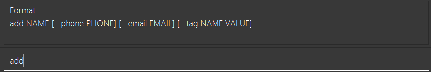
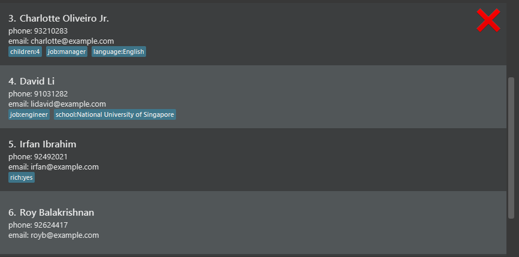
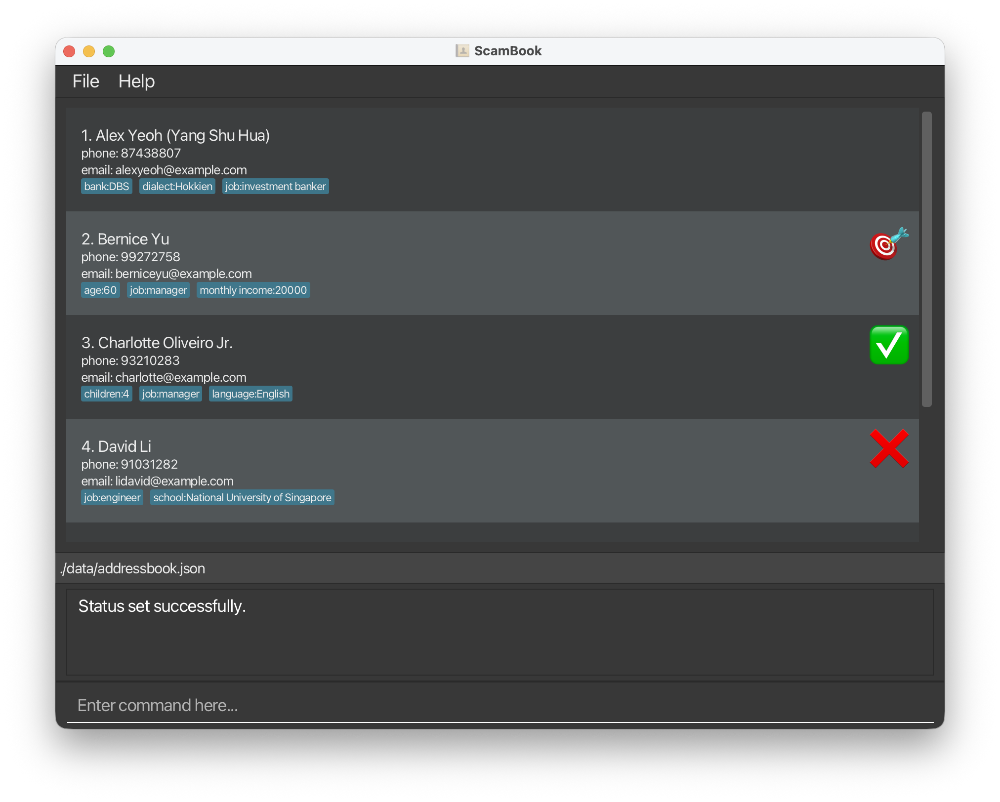
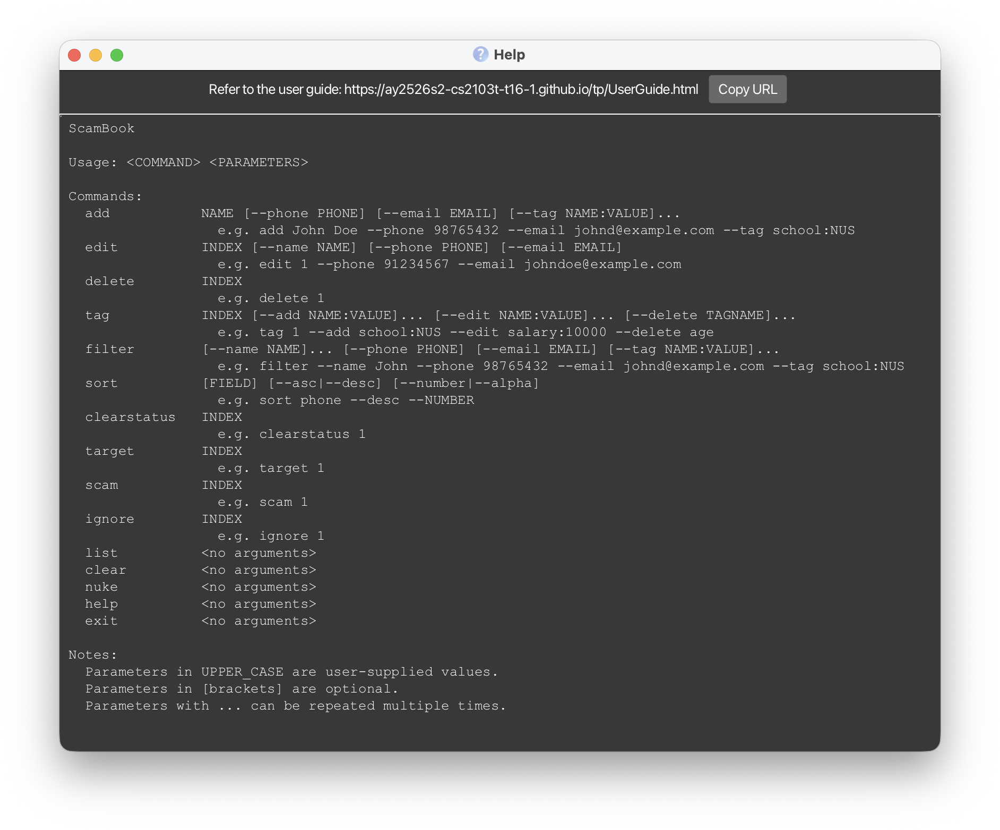
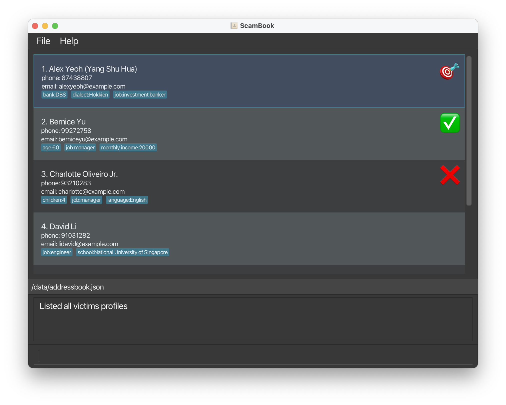
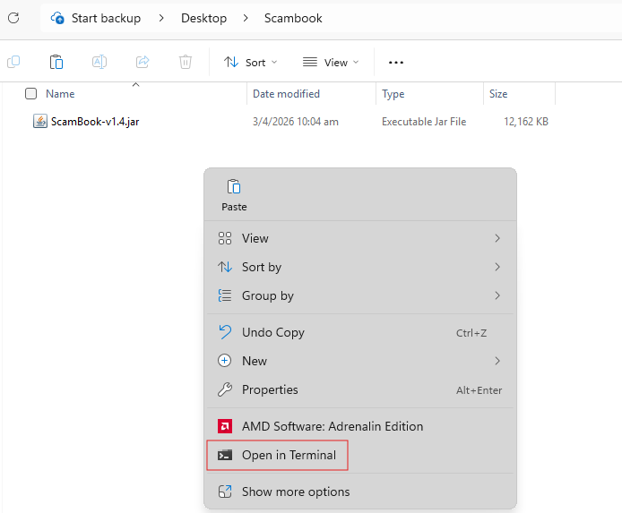

ScamBook User Guide
---

---------------------------------

<!-- * Table of Contents -->
<page-nav-print />

## Introduction

### What is ScamBook?

ScamBook is a **desktop contact management app** optimised for use via a Command Line Interface (CLI) while still having the benefits of a Graphical User Interface (GUI).  ScamBook allows users to track **large numbers of contacts** with flexible **user-defined** information metrics. It is equipped with features for users to **define and manipulate specific details** for each profile, offering maximum freedom to **record, filter, and sort** any detail. Plus, enjoy **ultimate security** with 100% **locally** stored data, erasable **instantly**.

### Who is ScamBook for?

ScamBook is designed for **investment and financial scam callers** targeting Singapore residents managing a high volume of victim contacts daily. If you are a scammer who:
* is **tech-savvy** and prefer typing to clicking, and comfortable with
  command line interfaces (CLI);
* operates as a **solo caller** and need a private, single-user system to
  manage your contacts;
* handles **hundreds to thousands of contacts** and need a system that can
  scale to your needs;
* needs to manage and update contacts **on-the-go during live calls**;

ScamBook is the app for you!

--------------------------------------------------------------------------------------------------------------------

<!-- Quickstart appropriate for target users and fit-for-purpose -->
## Quick start

<!-- Quickstart: Installation instructions -->
### Installation
1. Ensure you have Java `17` or above installed in your Computer. 
   **Mac users:** Ensure you have the precise JDK version found
   [here](https://se-education.org/guides/tutorials/javaInstallationMac.html).

1. Download the latest `.jar` file from
   [here](https://github.com/AY2526S2-CS2103T-T16-1/tp/releases).

1. Copy the file to the folder you want to use as the _home folder_ for
   your ScamBook.

1. Double-click on the `.jar` file to run the application. If the application does not launch,
refer to [troubleshooting](#troubleshooting) for alternate ways to launch the application.

<!-- Quickstart: Overview of UI -->
### Overview
A GUI similar to the below should appear in a few seconds. The app contains some sample data for you to use. 

    <small>Image credits for status icons: Downloaded from https://emoji.aranja.com/.</small>

 
The top part of the application is the contact list - you can view contacts there.

The box at the bottom that reads "Enter command here..." is where you enter commands. This is where you get to interact with ScamBook!

### Entering a Command

Suppose our contact list has 6 people in it. This example will show how to add a 7th contact.

We can use the `add` command to create a new contact. In the box at the bottom, type `add`.

Upon typing `add`, the format for the rest of the command will appear.
The command's format is `add NAME [--phone PHONE] [--email EMAIL] [--tag TAGNAME:TAGVALUE]...`.

Each command's format is given as a sequence of compulsory parameters, and optional parameters denoted in square brackets `[]`.
In this command, `NAME` is a compulsory parameter, while phone, email and tags are optional parameters.

Suppose we want to add a contact with the following information:
- Name: John Doe
- Phone: 88463679
- Extra information:
    - Job: teacher

We can enter the command `add John Doe --phone 88463679 --tag job:teacher` and press enter.

We can see that we have created a new contact John Doe.

To understand more about how to interpret the command formats, refer to [Command Format Information](#command-format-information). Refer to the [Command List](#commands) below for details of each command, or the [Commands Summary](#commands-summary) section for a quick summary of all commands and their formats. The [Constraints on input values](#constraints-on-input-values) section gives more details on the constraints of input values for each parameter.

<box type="tip" seamless>
<b>Tip:</b> Use the UP and DOWN arrow keys to navigate past command history.
</box>

--------------------------------------------------------------------------------------------------------------------

## Command Format Information

* All commands start with a single command word, which is case-sensitive and always in lowercase, followed by parameters if any.

* Words in `UPPER_CASE` are the parameters to be supplied by the user. They can contain spaces and special characters (except `INDEX`, which expects a single positive integer).  
  e.g. in `add NAME`, `NAME` is a parameter which can be used as `add John Doe`.

* Parameters in `[square brackets]` are optional. 
  e.g `NAME [--phone PHONE]` can be used as `John Doe --phone 88463679` or as `John Doe`.

* The Parameter `INDEX` refers to the number on the left side of the address book.
    * For example, the delete command has the format `delete INDEX`. If we type `delete 4`, ScamBook will delete David Li's entry in the below example:
      

 

* Parameters with `…`​ after them can be used multiple times (including zero times). 
  e.g. `[--tag TAGNAME:TAGVALUE]…​` can be used as ` ` (i.e. 0 times), `--tag school:NUS`, `--tag school:NUS --tag salary:10000` etc.
    * For each parameter that can be used multiple times, each command should contain up to 100 of such parameters. Above this, the command will be rejected.
    * In the above example of `[--tag TAGNAME:TAGVALUE]…​`, the command should have up to 100 occurrences of `--tag`.

* Mandatory parameters must come before optional parameters. 
  e.g. if the command specifies `NAME [--phone PHONE]`, `--phone 88091246 John` is not acceptable.

* Optional parameters can be in any order. 
  e.g. if the command specifies `[--phone PHONE] [--email EMAIL]`, `--email john@example.com --phone 91842739` is also acceptable.

<box type="warning" seamless>
If you are using a PDF version of this document, be careful when copying and pasting commands that span multiple lines as space characters surrounding line-breaks may be omitted when copied over to the application.
</box>

<box type="warning" seamless>
Users are strongly advised against using <code>--</code> for input values. While the parser can occasionally pick up such usage and correctly report an error, this is not guaranteed all the time, which might result in unexpected execution results. Furthermore, different commands may have different levels of support for values including <code>--</code>, hence profiles containing <code>--</code> might be inaccessible to other commands.
</box>

<!--
Command User guide format:

### Command description (within 5 words) : `command`
Short description of the command.

Format: `command [parameters]`

[Following sections are optional, include only if applicable (try to be minimal)]

<box type="warning" seamless>
Warning about the command, e.g. common mistakes, important notes, etc.
</box>

Expected output or behaviour if the command is executed successfully. Use
screenshots (properly cropped) only if necessary, e.g. if the output is too
long or contains formatting that is hard to represent in text.

Examples: [DO NOT include unrealistic examples (use realistic params.) and DO
NOT include unlikely user input (e.g., names with backslaches) if already
handled by the app.]
* `Expected input`
  Explanation of output or behaviour if needed

<box type="tip" seamless>
Tips about the command, e.g. how to use it more effectively, etc.
</box>

-->

## Commands

### Viewing command history

Similar to the command line interface of a terminal, you can use the up and down arrow keys to view your command history. This allows you to easily reuse or modify previous commands without having to retype them.

 

### Adding a person: `add`

Adds a person to the ScamBook.

Format: `add NAME [--phone PHONE] [--email EMAIL] [--tag TAGNAME:TAGVALUE]...`

* Duplicate names are allowed, since it is likely one might encounter multiple people with the same (first) names. Hence, ScamBook supports having multiple people with the same name, and no duplicate checking is performed.
* Phones and emails are optional, to cater for instances when the user does not have information about them at the point of adding the contact. No duplicate checking is performed on these fields as well, since these can be shared across users (e.g. home phone numbers, shared email addresses).
* If multiple tag name-value pairs have the same tag name (see section on [Tag](#tagging-a-person-tag) below regarding tag name equality), the last value will be used.
* There is no duplicate checking performed on people, hence there could be 2 identical profiles with identical attributes and tags, although such a scenario is quite unlikely (and would not break any features).

<box type="tip" seamless>
<b>Tip:</b> A person can have any number of tags (including 0).
</box>

Examples:
* `add John Doe --phone 98765432 --email johnd@example.com --tag address:John street, block 123, #01-01`
* `add Betsy Crower --tag income:$100000 --tag bank:OCBC`

 

### Editing a person : `edit`

Edits an existing person's name, phone number or email. For editing tags, see the [Tag Command](#tagging-a-person-tag).

Format: `edit INDEX [--name NAME] [--phone PHONE] [--email EMAIL]`

* Edits the person at the specified `INDEX`. The index refers to the index number shown in the displayed person list. The index **must be a positive integer** 1, 2, 3, …​
* At least one of the optional fields must be provided.
* Existing values will be overwritten by the input values.

Examples:
* `edit 1 --phone 91234567 --email johndoe@example.com` Edits the phone number and email address of the 1st person to be `91234567` and `johndoe@example.com` respectively.
* `edit 2 --name Betsy Crower` Edits the name of the 2nd person to be `Betsy Crower`.

 

### Deleting a person : `delete`

Deletes the specified person from the ScamBook.

Format: `delete INDEX`

* Deletes the person at the specified `INDEX`.

Examples:
* `list` followed by `delete 2` deletes the 2nd person in the ScamBook.
* `filter --name Betsy` followed by `delete 1` deletes the 1st person in the results of the `filter` command.

 

### Tagging a person : `tag`

A tag is a name-value pair that allows the user to record any arbitrary information so desired about a profile. This is achieved by this command, which modifies (add, edit or delete) the tags of an existing person in the ScamBook. Two tag names are considered equal if they are exactly equal character for character after removing leading and trailing whitespace.

In the image below of an example profile in the app, each blue box represents a tag-value pair capturing some useful information about the person.

 

Format: `tag INDEX [--add TAGNAME:TAGVALUE]... [--edit TAGNAME:TAGVALUE]... [--delete TAGNAME]...​`

* Edits the person at the specified `INDEX`. The index refers to the index number shown in the displayed person list. The index **must be a positive integer** 1, 2, 3, …​
* At least one of the optional fields must be provided, if not, the success message will be displayed with no visible changes. There will also be a disk write to save the (unchanged) ScamBook data. Refer to the [Saving the data](#saving-the-data) section for more details.
* Optional fields beginning with `--add` represent tags to be added to the person. The tag name must not already exist.
* Optional fields beginning with `--edit` represent tags to be modified of the person. The tag with the corresponding name must already exist.
* Optional fields beginning with `--delete` represent tags to be deleted. The tag with the corresponding name must already exist.

<box type="warning" seamless>
Users are strongly advised against using the same tag name across multiple optional fields, as behaviour could be unexpected. In particular, all <code>--add</code> tags are added first, then all <code>--edit</code> tags are edited, then all <code>--delete</code> are deleted.
</box>

Examples:
* `tag 10 --add school:National University of Singapore` Adds a tag with name `school` and value `National University of Singapore` to the tenth person. Note the support of spaces in the tag value.
* `tag 2 --delete age --edit monthly income:10000` Deletes an existing tag with name `age` and edits an existing tag with name `monthly income` to contain `10000` from the second person. Note the support of spaces in tag name and the flexible ordering of parameters.
* `tag 1 --add school:NUS --edit salary:10000 --delete age` Adds a tag with name `school` and value `NUS`, edits an existing tag with name `salary` to contain `10000` and deletes an existing tag with name `age` from the first person.

 

### Filtering the list of persons : `filter`

Filters the list of persons in the ScamBook to show only those that match the specified parameters.

Each use of `filter` replaces the current filtered view instead of further narrowing the existing one. To clear the current filter and show all persons again, use `filter` with no parameters.

Format: `filter [--name NAME]... [--phone PHONE]... [--email EMAIL]... [--status STATUS]... [--tag TAGNAME[:TAGVALUE]]...`

- Across different parameters, profiles match all conditions.
  e.g. `--name John --phone 9876` matches only persons whose name contains `John` and whose phone number contains `9876`.
- With repeated `--name`, `--phone`, `--email`, or `--status`, profiles match any of the specified values.
  e.g. `--name John --name Jane` matches persons whose name contains `John` or `Jane`.
- `NAME`, `EMAIL`, and `PHONE` conditions require case-insensitive partial match.
- `--phone NONE` matches persons with no phone field, and `--email NONE` matches persons with no email field.
- For phone or email filtering, `NONE` can be mixed with normal substrings.
  e.g. `--phone NONE --phone 9876` matches persons with no phone or with a phone containing `9876`.
- `STATUS` must be one of `NONE`, `TARGET`, `SCAM`, or `IGNORE` (case-insensitive).
- `--tag TAGNAME` checks whether a person has a tag with that name. `TAGNAME` must be a valid tag name, according to [this](#tag-constraints).
- `--tag TAGNAME:TAGVALUE` checks whether a person has a tag with that name whose value contains `TAGVALUE`.
- `TAGNAME` requires the exact tag name (case-insensitive), while `TAGVALUE` only requires partial match (case-insensitive).
- With repeated `--tag` filters with the same tag name, profiles match any of the specified values.
- For `--tag` filters with different tag names, profiles must match all conditions.

Examples:

- `filter --name John`
  Shows all persons whose name contains `John`.
- `filter --name John --name Jane`
  Shows all persons whose name contains `John` or `Jane`.
- `filter --status TARGET --status SCAM`
  Shows all persons whose status is either `TARGET` or `SCAM`.
- `filter --phone 9876 --email gmail.com`
  Shows all persons whose phone number contains `9876` and whose email contains `gmail.com`.
- `filter --phone NONE --email NONE`
  Shows all persons with no phone and no email.
- `filter --tag job`
  Shows all persons who have a tag named `job`, regardless of its value.
- `filter --tag job:manager --tag job:director`
  Shows all persons whose `job` tag contains `manager` or `director`.
- `filter --tag job --tag region:west`
  Shows all persons who have a tag named `job` (regardless of its value), and whose`region` tag contains `west`.
- `filter --tag job:manager --tag region:west`
  Shows all persons whose `job` tag contains `manager` and whose `region` tag contains `west`.
- `filter --name Tan --status TARGET --tag source:telegram`
  Shows all persons whose name contains `Tan`, whose status is `TARGET`, and whose `source` tag contains `telegram`.

<box type="tip" seamless>
The filter command affects the indices of the contacts. When using commands that take in <code>INDEX</code> as a parameter, note the index seen on the list.
</box>

<box type="tip" seamless>
After running another command (e.g. <code>add</code>),
if the new/edited person still fulfills the most recent filter applied, the displayed list will remain as the filtered list (with the added person, if any). Otherwise, the displayed list will revert to show all persons.
</box>

 

### Sorting the list of persons : `sort`

Sorts the current list of persons by a specified field.

Format: `sort [FIELD] [--asc|--desc] [--number|--alpha]`

* `FIELD` can be `name`, `phone`, `email`, or a tag name (e.g., `income`). Defaults to `name` if omitted.
* `--asc` sorts in ascending order (default), `--desc` sorts in descending order.
* `--number` sorts numerically where possible (default), `--alpha` sorts alphabetically.
* Entries with missing or invalid (e.g. non-numeric when sorting numerically) values for the specified field are placed at the end and sorting alphabetically in the user-specified direction.
* It is the onus of the user to use the more suitable sorting style, the app will not check the consistency between the field and sorting style. For example, if `--number` is used for a non-numeric field, all profiles will be considered invalid and processed accordingly.

Examples:
* `sort` Sorts by name in ascending order.
* `sort phone --desc --number` Sorts by phone number in descending numeric order.
* `sort income --alpha` Sorts by the `income` tag alphabetically.

<box type="tip" seamless>
The sorting persists even if multiple commands are run afterwards. For example, if a new person is added, he/she will be inserted into the correct position according to the current sorting order, which might not be at the end. Similarly, editing a person's information or tags may also change his/her positon in the list.
</box>

 

### Marking person status: `clearstatus`, `target`, `scam`, or `ignore`

Sets the status of a specific person. We currently support 4 common statuses, each represented by its corresponding command name. Referring the image below (same image as in the [Overview](#overview) section, reproduced here for convenience), the emoji of each profile represents its status, as set by each of the four commands, in order.
1. No status, via `clearstatus`.
2. A potential target, via `target`.
3. Already scammed, via `scam`.
4. To be ignored, via `ignore`.

Format: `status_command INDEX`

* `status_command` should be replaced by either one of `clearstatus`, `target`, `scam`, or `ignore`.
* Sets the status of the person at the specified `INDEX`.
* The new status overwrites any previously existing status, i.e. each person can have exactly 1 status at any time (no status is also a status).
* Setting a particular status for a person that already has the corresponding status will do nothing (and success message will be displayed).

Examples:
* `clearstatus 1` clears the first person of any indicated status.
* `target 2` marks the second person as a potential target.
* `scam 3` marks the third person to have been scammed.
* `ignore 4` marks the fourth person to be ignored (e.g. if you think the fourth person is unlikely to be a victim and you should not pursue this further).

 

### Listing all persons : `list`

Shows a list of ALL persons in the ScamBook, in their original creation order. This command can be used after `sort` or `filter` to revert ScamBook to its original state.

Format: `list`

 

### Clearing all persons : `clear`

Clears all persons from the ScamBook.

Format: `clear`

<box type="warning" seamless>
<b>Caution:</b> This action is irreversible. Use with caution.
</box>

 

### Deleting the app and all data: `nuke`

Deletes local data and the app JAR, then exits.

Format: `nuke`

* `nuke` does not accept any additional arguments.
* Deletes `[JAR file location]/data/addressbook.json`.
* Deletes `[JAR file location]/data/` only if the folder is empty after deleting `addressbook.json`.
* Attempts to delete the running application JAR file.

<box type="warning" seamless>
<b>Caution:</b> This action is irreversible. Use with caution.
</box>

 

### Viewing help : `help`

Shows a pop-up window explaining how to use the basic commands. For more details on how to use this
application, you can also click on **Copy URL** to access the user guide.

Format: `help`

 

### Exiting the program : `exit`

Exits the program.

Format: `exit`

 

--------------------------------------------------------------------

### Constraints on input values

#### Index Constraints
All `INDEX` parameters refer to the displayed index as shown in the current displayed list.

#### Name Constraints

Names can contain any alphanumeric characters, spaces, and the following special characters <code>,.()\`'/\-</code>.

Names should also contain at least one character

#### Phone Constraints

Phones should be a number between 3 and 20 digits in length. It should not contain spaces, or the `+` sign.
If such details are desired, they can be added as tags instead.
If multiple phone numbers are desired, such as home vs office numbers, they can be added as tags instead of using the `--phone` parameter multiple times.

#### Email Constraints
Emails should follow the format `local-part@domain` (e.g. `john.doe@example.com`), with the following constraints:

1. Email contains exactly one `@`.
2. `local-part` and `domain` should each contain at least one character.
3. `local-part` should contain alphanumeric characters and/or the special characters <code>!#$%&'*+/=?^_`{|}~.-</code>.
4. `local-part` should not start or end with a dot (`.`) and should not have consecutive dots.
5. `local-part` should not contain spaces.
6. `domain` should contain alphanumeric characters, dots (`.`) and/or hyphens (`-`).
7. `domain` should be a valid target hostname such as `gmail.com`, `example.com`.

ScamBook accepts a broader set of [RFC 5322 standards-compliant email addresses](https://datatracker.ietf.org/doc/html/rfc5322#section-3.4.1).

<box type="tip" seamless>
<b>Tip:</b> <code>filter --email</code> accepts any non-empty substring for matching (except the reserved keyword <code>NONE</code>, which matches missing email) and does not require a full valid email format.
</box>

#### Tag Constraints

1. Tag names and values must be non-empty (i.e. it must not consist of only whitespace characters).
2. Tag names and values must not contain colons (`:`), as they are used to separate names and values.
3. Tag names and values must not exceed 60 characters in length (excluding leading and trailing whitespace). This is to ensure that the display of tags in the GUI remains neat and tidy.
4. Tag names (after stripping leading and trailing whitespace) must not equal, case-insensitive, any of `name`, `email`, `phone` as these are reserved field names for the `sort` command.
5. Tag names and values can contain any other characters, if they satisfy the above two constraints.

 

---------------------------------------------------

### Saving the data

ScamBook data are saved in the hard disk automatically after the successful execution of any command. There is no need to save manually.

 

### Editing the data file

ScamBook data are saved automatically as a JSON file `[JAR file location]/data/addressbook.json`. Advanced users are welcome to update data directly by editing that data file.

<box type="warning" seamless>
<b>Caution:</b>
If your changes to the data file makes its format invalid, ScamBook will discard all data and start with an empty data file at the next run.  Hence, it is recommended to take a backup of the file before editing it. 
Furthermore, certain edits can cause the ScamBook to behave in unexpected ways (e.g., if a value entered is outside the acceptable range). Therefore, edit the data file only if you are confident that you can update it correctly.
</box>

 

---------------------------------------------------

### Autoscroll
- After making modifications to a contact, the app will scroll to and select the relevant contact. This behaviour
  occurs for these commands: `add`, `edit`, `tag`, `clearstatus`, `target`, `scam`, `ignore`.
- For these commands, the app will scroll to and select the first contact in the address book: `filter`, `sort`, `list`.

 

----------------------------------------------------------------------

## FAQ

### Troubleshooting

**Q**: My application does not launch when double-clicking on it. What should I do?  
**A**: The most reliable alternative is to launch it via the command line. To do so, navigate to the folder that
you have placed ScamBook in. Right click and open a terminal there.

From the terminal, type `java -jar <filename>.jar`. In the above example, you can type `java -jar ScamBook-v1.4.jar`
and press enter. This will launch the application.

On a Mac, if the option to open a terminal at the folder does not exist, refer to [this video guide](https://www.youtube.com/watch?v=wsI4Iast978) to enable the option.

**Q**: When I opened ScamBook, my previous session's changes weren't saved. Why?  
**A**: If ScamBook is in a write-protected folder, the program cannot save your data. Try checking your folder's properties, or moving ScamBook to another location.

### Miscellaneous

**Q**: I have a question that is not answered here. Where can I ask it? 
**A**: You can ask your question by creating a new issue in the [ScamBook
repository](https://github.com/AY2526S2-CS2103T-T16-1/tp/issues).

 

--------------------------------------------------------------------------------------------------------------------
## Future work
1. Currently, all data has to be either manually added via the commands, or by editing the `json` data file. Future work will support more mechanisms for data importation, such as reading directly from a `.csv` or `.xlsx` file.

2. A scammer might have different personas when operating, such as pretending to be personnel from different banks. A possible future direction is to allow users to create multiple sets of ScamBooks, each with their own separate details, so every distinct persona can have its own list of contacts.

 

--------------------------------------------------------------------------------------------------------------------

## Known issues

1. When using multiple screens, if you move the application to a secondary screen, and later switch to using only the primary screen, the GUI will open off-screen. The remedy is to delete the `preferences.json` file created by the application before running the application again.

2. On Windows OS, `nuke` may fail to delete the running application JAR due to file locking by the OS.

 

--------------------------------------------------------------------------------------------------------------------

## Commands summary
<!-- A summary of all commands. Should be of same/similar format as help
command output -->

| Command           | Functionality and Parameters                                                                                                                                                                     |
|-------------------|--------------------------------------------------------------------------------------------------------------------------------------------------------------------------------------------------|
| **`add`**         | Adds a new person `NAME [--phone PHONE] [--email EMAIL] [--tag TAGNAME:TAGVALUE]...`  e.g., `add John Doe --phone 98765432 --email johndoe@example.com --tag school:NUS`                   |
| **`edit`**        | Updates the name/phone/email of an existing person `INDEX [--name NAME] [--phone PHONE] [--email EMAIL]`  e.g., `edit 1 --name Jane Doe --phone 91234567 --email newemail@example.com`     |
| **`delete`**      | Deletes an existing person `INDEX`  e.g., `delete 5`                                                                                                                                       |
| **`tag`**         | Updates tags of an existing person `INDEX [--add TAGNAME:TAGVALUE]... [--edit TAGNAME:TAGVALUE]... [--delete TAGNAME]...`  e.g., `tag 1 --add school:NUS --edit salary:10000 --delete age` |
| **`filter`**      | Filters the master list `[--name NAME]... [--phone PHONE]... [--email EMAIL]... [--status STATUS]... [--tag TAGNAME[:TAGVALUE]]...`  e.g., `filter --name John --phone 98765432`           |
| **`sort`**        | Sorts the currently displayed list `[FIELD] [--asc\|--desc] [--number\|--alpha]`  e.g., `sort phone --desc --number`                                                                       |
| **`clearstatus`** | Clears the status of an existing person `INDEX`  e.g., `clearstatus 1`                                                                                                                     |
| **`target`**      | Marks an existing person as a target `INDEX`  e.g., `target 2`                                                                                                                             |
| **`scam`**        | Marks an existing person as scammed `INDEX`  e.g., `scam 3`                                                                                                                                |
| **`ignore`**      | Marks an existing person as ignored `INDEX`  e.g., `ignore 4`                                                                                                                              |
| **`list`**        | Lists all contacts                                                                                                                                                                               |
| **`clear`**       | Deletes all contacts                                                                                                                                                                             |
| **`nuke`**        | Deletes `addressbook.json`, removes `data/` if empty, attempts to delete the running app JAR, and exits                                                                                          |
| **`help`**        | Shows the help message                                                                                                                                                                           |
| **`exit`**        | Exits the application                                                                                                                                                                            |
