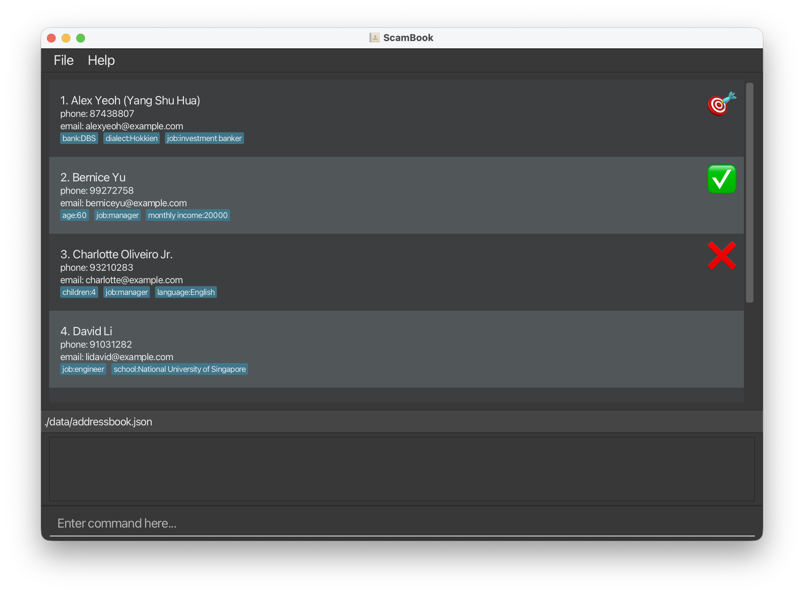

# ScamBook

**ScamBook is a desktop application for call-based scammers to maintain and track their database of contacts.** It is optimized for tech-savvy typing-preferred users, with a greater focus on CLI features compared to GUI.

* If you are interested in using ScamBook, head over to the [User Guide](UserGuide.html).
* If you are interested about developing ScamBook, the [Developer Guide](DeveloperGuide.html) is a good place to start.

### Acknowledgements

* This project is based on the AddressBook-Level3 project created by the [SE-EDU initiative](https://se-education.org).
* Libraries used: [JavaFX](https://openjfx.io/), [Jackson](https://github.com/FasterXML/jackson), [JUnit5](https://github.com/junit-team/junit5)
* Image credits for status icons: Downloaded from https://emoji.aranja.com/.

### Disclaimer

**1. Intended Use**

This project is developed strictly for academic purposes as part of the CS2103T module at the National University of Singapore (NUS). It is a student-led Proof of Concept (PoC) intended for educational demonstration only. It is not intended for deployment in real-world environments.

**2. No Warranty & Limitation of Liability**

The software is provided "as is," without warranty of any kind, express or implied. In no event shall the authors, the project team, or the University be liable for any claim, damages, or other liability - whether in contract, tort, or otherwise - arising from the use, misuse, or inability to use this software.

**3. Indemnification & Compliance**

Any use of this code outside of the specified academic context is unauthorized and conducted at the user’s sole risk. The user is exclusively responsible for ensuring compliance with the Singapore Computer Misuse Act and all applicable local and international laws. By using this software, you agree to hold the authors harmless from any legal or technical consequences resulting from your actions.
